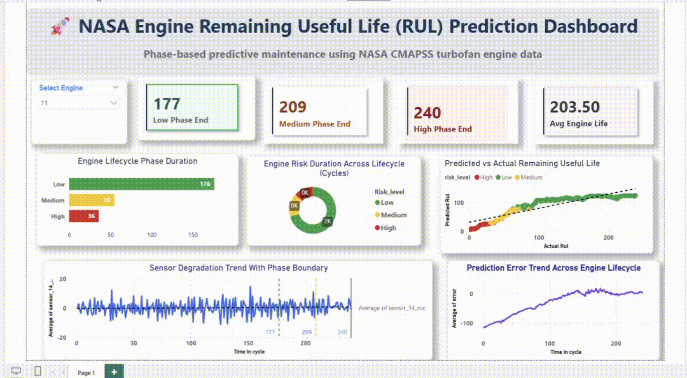

Below is a **complete, industry-level README.md** you can directly paste into your GitHub repository.
It is **interview-ready**, **business-focused**, and explains **all graphs + cost savings** clearly.

---

# 🚀 NASA Engine Remaining Useful Life (RUL) Prediction

**Phase-Based Predictive Maintenance using NASA CMAPSS Turbofan Engine Data**

---

## 📌 Business Problem

In aviation and heavy industries, **unexpected engine failure** leads to:

* ✈️ Unplanned aircraft grounding
* 💸 Extremely high maintenance costs
* ⏱️ Operational delays and safety risks

Traditional maintenance strategies are:

* **Reactive** (fix after failure) ❌
* **Time-based** (replace too early) ❌

Both approaches waste **money, time, and asset life**.

---

## 🎯 Business Objective

Build a **predictive maintenance system** that:

* Predicts **Remaining Useful Life (RUL)** of engines
* Detects **degradation phases** (Low → Medium → High risk)
* Enables **condition-based maintenance decisions**
* Visualizes engine health in a **decision-friendly dashboard**

---

## 🧠 Solution Overview

This project uses **NASA CMAPSS turbofan engine sensor data** to:

1. Track sensor degradation over time
2. Identify **lifecycle phases** of an engine
3. Predict **RUL using ML models**
4. Convert predictions into **business-ready alerts & KPIs**
5. Present insights through a **Power BI executive dashboard**

---

## 🏗️ System Architecture

**Data → Feature Engineering → ML Model → Risk Phases → Dashboard**

* Dataset: NASA CMAPSS
* Features:

  * Rolling Mean (trend)
  * Rolling Std (instability)
  * Rate of Change (degradation speed)
* Models:

  * XGBoost (primary)
* Output:

  * Predicted RUL
  * Risk Level (Low / Medium / High)

---

## 📊 Dashboard Explanation (Graph-by-Graph)
  ## 🎥 Dashboard Preview

---

### 🟢 KPI Cards (Top Row)

| KPI                  | Meaning                               |
| -------------------- | ------------------------------------- |
| **Low Phase End**    | Last cycle where engine is healthy    |
| **Medium Phase End** | Degradation starts accelerating       |
| **High Phase End**   | Engine nearing failure                |
| **Avg Engine Life**  | Average lifespan across all engines   |
| **Engines Trained**  | Total engines used for model training |

👉 **Why it matters**
Management instantly knows **when intervention is required**.

---

### 📊 Engine Lifecycle Phase Duration (Bar Chart)

Shows **how long an engine stays in each phase**:

* Low (healthy)
* Medium (warning)
* High (critical)

👉 **Insight**
Helps planners understand **maintenance windows** and degradation speed.

---

### 🍩 Engine Risk Duration Across Lifecycle (Donut Chart)

Displays **cycle distribution by risk level**.

👉 **Insight**
Quick answer to:

> “How much of engine life is spent in risky conditions?”

---

### 📈 Sensor Degradation Trend with Phase Boundaries

* X-axis → Time in cycles
* Y-axis → Sensor degradation (ROC / rolling mean)
* Vertical lines:

  * 🟢 Low Phase End
  * 🟡 Medium Phase End
  * 🔴 Total Engine Life

👉 **Insight**
Visually proves **sensor behavior changes before failure**
(critical for explainability).

---

### 🎯 Predicted vs Actual RUL (Model Accuracy)

* X-axis → Actual RUL
* Y-axis → Predicted RUL
* Diagonal line → Perfect prediction

👉 **Insight**

* Points close to diagonal = good model
* Shows **trustworthiness of predictions**

---

### 📉 Prediction Error Trend Across Lifecycle

Tracks **model error vs time**.

👉 **Insight**

* Error reduces as engine approaches failure
* Model becomes **more confident near decision time**

---

## 💰 Business Impact & Cost Savings

### 💸 Cost of Unplanned Engine Failure (Industry Average)

| Item                  | Cost          |
| --------------------- | ------------- |
| Emergency maintenance | $250,000      |
| Aircraft grounding    | $150,000      |
| Operational delay     | $100,000      |
| **Total per failure** | **~$500,000** |

---

### ✅ With This Predictive System

* Failure prediction **20–30 cycles earlier**
* Prevents **unplanned breakdowns**
* Enables **scheduled maintenance**

### 📉 Conservative Savings Estimate

Assume:

* 100 engines
* Failure prevention for just **10 engines/year**

**Savings = 10 × $500,000 = $5 MILLION / year**

> Even a **5–10% improvement** delivers **multi-million dollar savings**.

---

## 🧪 Model Performance (Example)

* MAE: ~11 cycles
* RMSE: ~16 cycles

👉 **Operational meaning**
Maintenance teams get **2–3 weeks advance notice** (depending on cycle duration).

---

## 🛠️ Tech Stack

* **Python** – Feature engineering & ML
* **XGBoost** – RUL prediction
* **Pandas / NumPy** – Data processing
* **Power BI** – Executive dashboard
* **NASA CMAPSS** – Benchmark dataset

---

## 🧠 Key Learnings

* Sensor trends degrade **before failure**
* Rate of Change is a strong early-warning indicator
* Phase-based interpretation improves **business trust**
* Visualization is as important as model accuracy

---

## 🏆 Resume-Ready Summary

> Built a phase-based predictive maintenance system using NASA CMAPSS turbofan engine data to predict Remaining Useful Life (RUL). Implemented advanced feature engineering, trained ML models, and designed an executive Power BI dashboard that enables early failure detection and delivers multi-million-dollar cost-saving insights.

---

## 🔮 Future Enhancements

* Deep Learning (LSTM / Transformers)
* Real-time streaming sensors
* Automated maintenance alerts
* Fleet-level optimization

